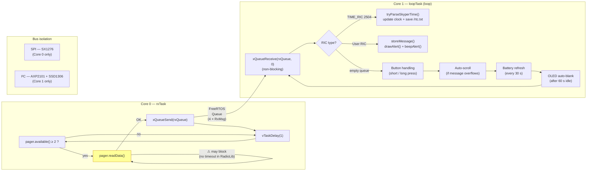
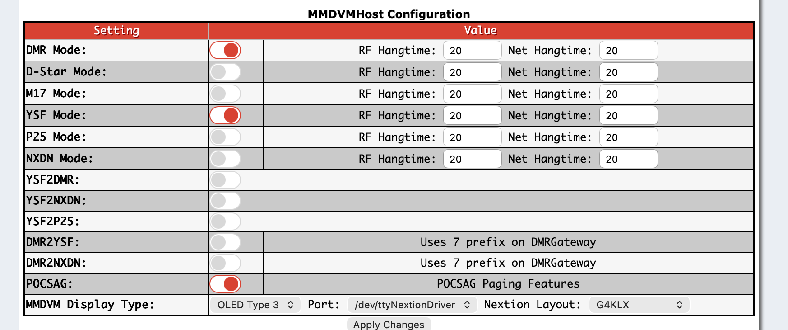
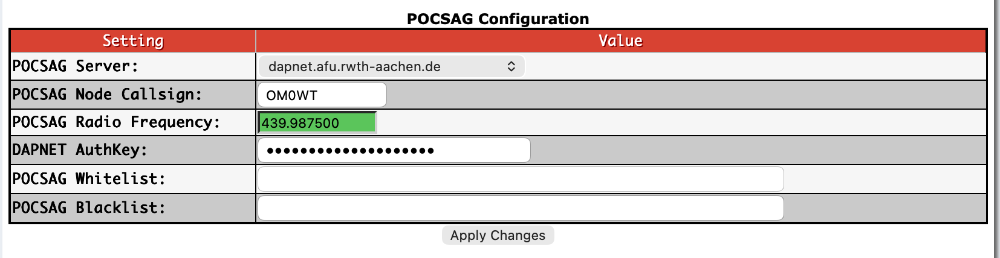
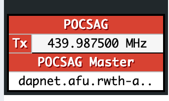
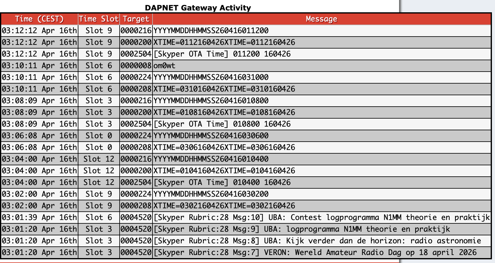

# T-Beam Pager

**Author:** Pavol Calfa (OM0WT)

A stand-alone Arduino firmware that turns a **LilyGO T-Beam v1.2** into a
fully self-contained **DAPNET POCSAG pager receiver**. The radio listens on
the DAPNET frequency, filters on user-assigned RICs, shows arriving messages
on the built-in OLED, beeps the piezo, and keeps the inbox in SPIFFS across
reboots — all without any network connection.

## Demo

<p align="center">
  
</p>

End-to-end walkthrough: Pi-Star POCSAG gateway sends a message, T-Beam
alerts with sender + body in large font, inbox navigation, detail view
with auto-scroll for long messages.

> Full-resolution MP4 available at [`assets/TBeamPager.mp4`](assets/TBeamPager.mp4)
> (LFS-tracked, 72 MB — GitHub's web UI can't preview files that large;
> clone locally or use `View raw` to download).

## Features at a glance

- 📡 **Receives DAPNET POCSAG** on 439.9875 MHz (SX1276 in 2FSK/1200 bps mode) —
  no WiFi, no internet, no subscription.
- 🎯 **Multi-RIC filtering** — up to 8 personal RICs configurable via
  `config.json`, filtered in hardware by the SX1276.
- ⏰ **Network-delivered RTC** — syncs clock from DAPNET's Skyper OTA Time
  broadcast (RIC 2504, ~every 5 min). No GPS, no NTP, no RTC chip needed.
- 💾 **RTC persistence across resets** — saves last sync to SPIFFS; restores
  on boot. Optional CR1220 coin cell keeps time through full power-off.
- 🔔 **Big-font alerts + piezo beep** on every personal RIC message; alert
  screen stays lit until user acknowledges.
- 📜 **Auto-scroll for long messages** — smooth pixel-by-pixel vertical scroll
  with pause at top/bottom.
- 🗂 **Persistent inbox** — last 20 messages kept in SPIFFS across reboots,
  sorted chronologically by embedded timestamp.
- 🔌 **Fragment reassembly** — concatenates POCSAG multi-batch fragments
  from the same RIC within 5 s.
- 🧠 **Dual-core architecture** — POCSAG reception on Core 0 (may block in
  RadioLib), UI on Core 1 (always responsive, watchdog-protected).
- 🌍 **Human-readable timezones** — `"Europe/Bratislava"` resolved from an
  editable `tz.csv` table (60+ zones, no recompile needed).
- 🗣 **Multi-language UI** — English, Slovak, French, Spanish, Portuguese.
- 🔋 **Smart charging + battery UI** — AXP2101 PMU at 500 mA CC, T-Beam
  TS-pin workaround, per-percent battery indicator.
- 💤 **OLED auto-blank** after 10 s on idle screen only; inbox/detail stay
  lit while user browses.
- 🎛 **Single-button UI** — short/long press state machine across 4 screens.
- ⚙️ **No binary reflash for config changes** — edit `data/config.json` and
  re-upload SPIFFS only.

## Project layout

```
TBeamPager/
├── ESP32-TBEAM-PAGER/
│   ├── ESP32-TBEAM-PAGER.ino     ← single-file firmware
│   └── data/
│       ├── config.json           ← per-device config (SPIFFS)
│       └── tz.csv                ← timezone alias → POSIX lookup table
├── assets/
│   ├── TBeamPager.mp4            ← demo video
│   └── screenshots/              ← Pi-Star screenshots used below
├── CLAUDE.md                     ← notes for AI pair-programmers
└── README.md                     ← you are here
```

---

## 1. The platform: what DAPNET is, and where this pager fits in

**DAPNET** (*Decentralized Amateur Paging Network*) is a world-wide, amateur
radio–operated POCSAG paging network run by volunteers. It multiplexes short
text messages (rubric news, personal messages, contest spots, emergency
broadcasts, time broadcasts) to pagers registered on [hampager.de][dapnet].
Transmission is pure one-way POCSAG — the pager never talks back.

A complete DAPNET reception chain looks like this:

```
[ DAPNET core  ]  ──(internet)──►  [ Pi-Star + MMDVM hotspot ]
  (hampager.de)                      (POCSAG transmitter on
                                      439.9875 MHz in IARU R1)
                                              │
                                              ▼ RF (2FSK, 1200 bps)
                                     [ T-Beam Pager ]  ← this project
                                       (SX1276 RX +
                                        SSD1306 OLED)
```

Two independent jobs are involved:

1. **Transmit side** — a *Pi-Star / WPSD* hotspot with an **MMDVM** board
   (e.g. MMDVM_HS_Hat, Jumbospot, DVMega) is configured as a **DAPNET
   transmitter**. It connects to a DAPNET core server, authenticates, and
   keys up the local MMDVM board whenever a message is scheduled for that
   transmitter's coverage area.
2. **Receive side** — this firmware. The T-Beam's SX1276 is set to 2FSK
   demodulation at 1200 bps on the DAPNET RF carrier, RadioLib's
   `PagerClient` decodes the POCSAG frames, and the ESP32 filters them on
   a configurable list of RIC addresses.

DAPNET is free for licensed amateurs. Registering a personal RIC takes a
few minutes at [hampager.de][dapnet] — the admins will assign you a
numeric RIC that then needs to go into `config.json` on this device.

[dapnet]: https://hampager.de/

---

## 2. Hardware

This firmware targets exactly one board: **LilyGO T-Beam v1.2** (the
AXP2101 / SX1276 revision — *not* the older v1.1 with AXP192, and *not*
the SX1262 ("T-Beam Supreme") variants).

| Component   | Model              | Bus / pin                       |
|-------------|--------------------|---------------------------------|
| MCU         | ESP32-WROOM-32     | 240 MHz, downclocked to 80 MHz |
| Radio       | Semtech SX1276     | SPI: SCK 5 / MISO 19 / MOSI 27 / CS 18; DIO0 26, DIO1 33, DIO2 32, RST 23 |
| PMU         | X-Powers AXP2101   | I²C 0x34 on SDA 21 / SCL 22    |
| OLED        | SSD1306 128×64     | I²C 0x3C on SDA 21 / SCL 22 (shared with PMU) |
| Button      | *USR*              | GPIO 38 (active LOW)            |
| Buzzer      | Passive piezo      | GPIO 25 (driven with `tone()`)  |
| GPS         | u-blox NEO-6/8M    | **kept powered off** (ALDO3)    |

Key points specific to T-Beam v1.2:

- **The user button is GPIO 38** on v1.2. Earlier TTGO variants used GPIO 0;
  example sketches on the net that target GPIO 0 will not react to your
  button.
- **The AXP2101 lives on the same I²C bus as the OLED.** You must bring the
  PMU up *before* the OLED, because the PMU also gates some of the rails
  the OLED depends on.
- **The battery has no NTC thermistor** wired to the AXP2101's TS pin.
  If you leave `disableTSPinMeasure()` out of your setup, the PMU reads an
  out-of-range temperature, reports "charging" while silently falling back
  to a 60 mA trickle, and a dead battery will *never* actually reach full.
  This firmware disables TS measurement at boot.
- **VBUS current limit defaults to ~100 mA.** If you don't raise it
  (`setVbusCurrentLimit(1500MA)`), the charger is input-starved and takes
  forever even at 1 A-capable USB ports. The firmware raises this at
  boot.

Required Arduino libraries (install via Library Manager):

- [RadioLib](https://github.com/jgromes/RadioLib) — POCSAG decoder
- [XPowersLib](https://github.com/lewisxhe/XPowersLib) — AXP2101 driver
- [Adafruit SSD1306](https://github.com/adafruit/Adafruit_SSD1306) + [Adafruit GFX](https://github.com/adafruit/Adafruit-GFX-Library)
- [ArduinoJson](https://arduinojson.org/) (v6 or v7 both work)

---

## 3. Firmware architecture

Single `.ino` file, intentionally. Rough top-to-bottom layout:

| Section              | Responsibility |
|----------------------|----------------|
| Includes + pin map   | Hardware constants                                   |
| `struct Config`      | Per-device settings loaded from `data/config.json`   |
| `struct PagerMsg`    | One inbox entry (addr, text, timestamp, flags)       |
| `struct RxMsg` + `rxTask()` | Core 0 POCSAG reception task + FreeRTOS queue  |
| `translations[][]`   | ASCII-only UI strings in EN / SK / FR / ES / PT      |
| Scroll state         | Auto-scroll globals for long messages                |
| Helpers              | `disableRadios()`, `updateBattery()`, clock format   |
| Config + persistence | `loadConfig()`, `saveMessageToFS()`, `loadSavedMessages()` |
| UI drawers           | `drawIdle()` / `drawAlert()` / `drawInbox()` / `drawDetail()` |
| `setup()`            | Power path + radio + RIC filter + spawn rxTask       |
| `loop()` (Core 1)    | Queue polling, button state machine, scroll, auto-sleep |

### 3.1 Dual-core architecture

The ESP32 has two Xtensa cores. This firmware uses both:



```
Core 0 — rxTask (POCSAG reception)          Core 1 — loopTask (UI + everything else)
┌────────────────────────────────┐          ┌──────────────────────────────────────┐
│  pager.available()             │          │  xQueueReceive(rxQueue)              │
│  pager.readData()  ← may block │──queue──►│  button handling                     │
│  (runs forever in a loop)      │          │  drawIdle/Alert/Inbox/Detail         │
│                                │          │  battery updates, auto-scroll        │
│  Idle task WDT: DISABLED       │          │  Loop task WDT: ENABLED (5 s)        │
└────────────────────────────────┘          └──────────────────────────────────────┘
```

**Why dual-core matters:** RadioLib's `PagerClient::readData()` internally
calls `PhysicalLayer::read()` which polls the SX1276's DIO2 pin in a
tight loop waiting for POCSAG clock transitions. When a POCSAG
transmission ends mid-frame (interference, timeslot change), `read()`
blocks **indefinitely** — there is no timeout in RadioLib. If this ran
on Core 1, the entire UI would freeze.

The solution: `rxTask` runs on Core 0 with the idle task watchdog
disabled (so RadioLib can block without triggering a reset). When a
complete message is decoded, it's posted to a 4-entry FreeRTOS queue.
`loop()` on Core 1 drains the queue with a non-blocking
`xQueueReceive(..., 0)` — the UI never waits for the radio.

The buses don't conflict: Core 0 only touches SPI (SX1276), Core 1 only
touches I²C (AXP2101 + SSD1306). No locking is needed.

### 3.1 Power path (`setup()`, order-sensitive)

The order matters — several of these steps silently break each other:

1. **Kill WiFi + Bluetooth, drop CPU to 80 MHz.** This is a pager, never a
   network device; the extra draw is wasted and WiFi RF can desense the
   SX1276 RX.
2. **Bring up AXP2101 on I²C** (same pins as OLED).
3. **Switch regulators:**
   - `ALDO2` → 3.3 V (OLED + radio logic rail)
   - `DC1`   → 3.3 V (main rail)
   - `ALDO3` → off (keeps the NEO-6M GPS powered down)
4. **Charger / ADC setup** (this is where the T-Beam v1.2 gotchas live):
   ```cpp
   pmu.setVbusCurrentLimit(XPOWERS_AXP2101_VBUS_CUR_LIM_1500MA);
   pmu.disableTSPinMeasure();
   pmu.setChargeTargetVoltage(XPOWERS_AXP2101_CHG_VOL_4V2);
   pmu.setChargerConstantCurr(XPOWERS_AXP2101_CHG_CUR_500MA);
   pmu.setPrechargeCurr(XPOWERS_AXP2101_PRECHARGE_200MA);
   pmu.setChargerTerminationCurr(XPOWERS_AXP2101_CHG_ITERM_25MA);
   ```
5. **SSD1306 init on I²C 0x3C**, then SX1276 init on SPI.

### 3.3 RadioLib POCSAG RX

The SX1276 is configured via RadioLib's generic FSK mode (`beginFSK()`),
then `PagerClient::begin(frequency + offset, 1200)` wires up the POCSAG
framer at 1200 bps. The base frequency defined in the firmware is
**439.98750 MHz** (the IARU R1 POCSAG allocation DAPNET uses) plus a
small **+4.4 kHz** hardware crystal trim that matches the author's board;
adjust `frequency` / `offset` at the top of the sketch if your SX1276 is
off-frequency.

Multi-RIC filtering is done in hardware by the SX1276, driven by
`PagerClient::startReceive(pin, addrs[], masks[], n)`. Important: **the
address and mask arrays must outlive `setup()`** because RadioLib only
stores pointers. The firmware declares them `static` inside `setup()` so
they end up in BSS and keep their lifetime.

The RIC filter always includes:

- every RIC from `config.json` (up to 8) with mask `0xFFFFF` (exact
  match)
- **RIC 2504** — DAPNET's "Skyper OTA Time" broadcast — used as a
  network-delivered RTC source

All radio access (`pager.available()`, `pager.readData()`) happens
exclusively inside `rxTask` on Core 0. The main loop on Core 1 never
touches SPI or the radio object directly.

**Fragment reassembly:** RadioLib's `readData()` returns only one POCSAG
batch at a time (~40–50 characters). Messages longer than one batch are
delivered as multiple consecutive fragments with the same RIC address.
The firmware detects this: when a new fragment arrives from the **same
RIC within 5 seconds** (`FRAG_WINDOW_MS`) of the previous one, it is
appended to the existing inbox entry instead of creating a new message.
Only the first fragment triggers the piezo alert; continuations silently
update the displayed text. Serial log shows `[FRAG] appended → N chars`
when reassembly occurs.

### 3.4 Time-of-day sync + RTC persistence

WiFi is off and the GPS is powered down, so on a fresh cold boot the
clock reads 0. The firmware obtains real time from DAPNET's **Skyper OTA
Time** broadcast on RIC 2504 (sent roughly every 5 minutes by the
network). The payload format is:

```
[Skyper OTA Time] HHMMSS DDMMYY
```

On first matching reception, `tryParseSkyperTime()` calls `settimeofday()`
with the parsed UTC, then switches the POSIX TZ string to
`CET-1CEST,M3.5.0/2,M10.5.0/3` (Central European time with automatic DST
transitions — change this for your region). A boolean `rtcValid` flips
true, and the UI replaces `--:--` with the real clock.

**RTC persistence across resets:** every successful time sync also writes
the epoch to `/rtc.txt` on SPIFFS. On boot, the firmware checks three
sources in order:

1. **ESP32 internal RTC** — survives soft resets (watchdog, `esp_restart`)
   and stays powered as long as the LiPo battery is connected. If
   `time(nullptr) > 2024-epoch`, the clock is accepted immediately.
2. **SPIFFS `/rtc.txt`** — survives full power-off (battery removed,
   coin-cell keeps SPIFFS flash). The saved epoch may be hours or days
   stale, but it's better than `--:--` and gets corrected on the next
   Skyper broadcast.
3. **Skyper OTA** — the definitive source. Overwrites the above within
   ~5 minutes of power-on.

If a CR1220 coin cell is installed in the T-Beam's battery holder, the
ESP32's RTC domain stays powered even with the main LiPo removed, giving
accurate time immediately on boot.

Timestamps attached to stored messages use epoch seconds when `rtcValid`
is true, and fall back to `millis() / 1000` (uptime seconds) otherwise.
The flag `PagerMsg::tsIsEpoch` records which mode was used, so inbox
rendering can show real dates or `"123s ago"` correctly.

### 3.5 Message persistence (SPIFFS)

SPIFFS is flat — there are no real directories, only filenames that
happen to contain slashes. The firmware treats the configured
`messageFolder` as a prefix filter:

- **Filename** (when RTC is synced):
  `/msgs/<ric>_<YYYYMMDDHHMMSS>.txt`
- **Filename** (before first time sync):
  `/msgs/<ric>_u<uptimeSec>.txt`
- **Collision suffix** for two messages in the same second: `_a`, `_b`, …
- **Body** — one line: `<epoch>\t<ric>\t<text>\n`

On boot, `loadSavedMessages()` scans `/`, filters by prefix, reads each
file, sorts **by the epoch stored inside the file** (not by filename —
RIC-first names don't sort chronologically when multiple RICs are
involved), keeps the newest `MAX_MSGS` (20), and reconstructs the inbox.

### 3.6 UI state machine

Four screens, one button, short-press vs. long-press:

| Screen        | What it shows                                      | Short press              | Long press |
|---------------|-----------------------------------------------------|--------------------------|------------|
| `SCR_IDLE`    | Clock + RIC + message count + battery              | Open inbox (if any msgs) | Stay here  |
| `SCR_ALERT`   | Newly arrived message, big font                    | Open inbox               | → IDLE     |
| `SCR_INBOX`   | Scrollable list, highlighted cursor                | Open detail              | → IDLE     |
| `SCR_DETAIL`  | Full message body, sender + age header             | Next message (wraps)     | → IDLE     |

A new message to a user RIC **always** jumps to `SCR_ALERT` regardless
of current screen, wakes the OLED, beeps three short two-tone chirps,
and resets the activity timer. Broadcasts on RIC 2504 are silent — they
update the clock and nothing else. After 60 seconds of no activity
(and not currently showing an alert), the framebuffer is blanked —
there's no hardware sleep, just `display()` with an empty buffer.

The top status bar shows the RX frequency + the primary user RIC
(`439.988 1234567`) plus battery percent; when there are unread messages
the frequency block is replaced with `N new`.

**Auto-scroll for long messages:** both `SCR_ALERT` and `SCR_DETAIL`
render the message body at text size 2 (12×16 px). At 10 characters per
line and 3 visible lines, messages longer than ~30 characters overflow
the display. When this happens, the firmware automatically scrolls the
body: 2 s pause at the top → smooth pixel-by-pixel scroll (80 ms/step)
→ 2 s pause at the bottom → wrap to top. The header (sender + clock)
stays fixed while the body scrolls underneath it.

---

## 4. Configuration (`data/config.json`)

Per-device settings live on SPIFFS, not in the binary — so one compiled
`.ino` flashes to many boards with different personal RICs and UI
languages.

```json
{
  "rics":          [1234567],
  "lang":          "en",
  "storeMessages": true,
  "messageFolder": "/msgs",
  "tz":            "Europe/Bratislava"
}
```

| Key             | Meaning                                                                 |
|-----------------|-------------------------------------------------------------------------|
| `rics`          | JSON array of up to 8 numeric RIC addresses this pager should match.    |
| `lang`          | UI language: `en`, `sk`, `fr`, `es`, `pt` (ASCII-only, no diacritics).  |
| `storeMessages` | `true` → persist every received message to SPIFFS; `false` → RAM only.  |
| `messageFolder` | Path prefix for stored messages. Default `/msgs`.                       |
| `tz`            | Timezone — either a human-readable alias (resolved via `data/tz.csv`) or a raw POSIX TZ string. See below. |

**Timezone resolution:** on boot, `resolveTzAlias()` reads `/tz.csv` from
SPIFFS line by line, looking for a match on the `tz` value from config.
If found, the alias is replaced with the corresponding POSIX TZ string
(e.g. `Europe/Bratislava` → `CET-1CEST,M3.5.0/2,M10.5.0/3`). If no
alias matches, the value is used as-is — so advanced users can enter a
raw POSIX TZ string directly (e.g. `CET-1CEST,M3.5.0/2,M10.5.0/3`).

The `tz.csv` file ships with 60+ entries covering Europe, US, Asia,
Australia, and Africa. Adding a timezone = adding one line to `tz.csv`
and re-uploading SPIFFS.

Baked-in defaults in the sketch match this file and are used if SPIFFS
mount or JSON parse fails.

---

## 5. Build & flash (Arduino IDE)

1. **Board**: *ESP32 Dev Module*
2. **Upload Speed**: `115200`
3. **Partition Scheme**: *Default 4 MB with 1.5 MB SPIFFS* (required — the
   sketch needs a SPIFFS partition for `config.json` and the inbox).
4. Install the libraries listed in §2.
5. **Create your local config**: copy
   `ESP32-TBEAM-PAGER/data/config.json.example` to
   `ESP32-TBEAM-PAGER/data/config.json` and edit your personal RIC(s),
   language and timezone. `config.json` is git-ignored so your RIC is
   never committed.
6. **Two-step upload** (both are needed):
   - **Sketch Data Upload** via the *ESP32 Sketch Data Upload* plugin
     (Tools menu). This writes `ESP32-TBEAM-PAGER/data/config.json` into
     the SPIFFS partition.
   - **Sketch Upload** — the usual *Upload* button.
7. Open Serial Monitor at 115200 baud to see boot log.

If you edit `data/config.json` (different RIC, different language,
enable/disable message storage) you must re-run **Sketch Data Upload** for
the change to take effect on device — the sketch itself doesn't need to
be re-flashed.

---

## 6. Setting up the Pi-Star side (DAPNET gateway on MMDVM)

To actually receive something, there has to be a DAPNET transmitter on
air within RF range. If you run your own hotspot, this means configuring
**Pi-Star (or WPSD)** to enable the POCSAG gateway mode.

### 6.1 Enable POCSAG in MMDVMHost

*Pi-Star → Configuration → MMDVMHost Configuration*



- Flip **POCSAG Mode** to **on** (red indicator).
- You can leave other digital modes at whatever you already use — DMR,
  YSF, and POCSAG multiplex fine on the same MMDVM board, one at a time.
- **MMDVM Display Type**: match whatever display you have wired (OLED
  Type 3 + `/dev/ttyNextionDriver` in the screenshot; `None` is fine if
  you run headless).
- **Apply Changes** once you're done — the page will restart `mmdvmhost`.

### 6.2 POCSAG / DAPNET gateway configuration

*Pi-Star → Configuration → Expert Editor → DAPNET Gateway* (or the
*POCSAG Configuration* block on newer Pi-Star / WPSD builds):



| Field                  | What to put in                                                                 |
|------------------------|---------------------------------------------------------------------------------|
| **POCSAG Server**      | A DAPNET core hostname — `dapnet.afu.rwth-aachen.de` is the primary.            |
| **POCSAG Node Callsign** | The callsign you **registered the transmitter with** at hampager.de. Not your personal call unless you also registered that transmitter to your own call. |
| **POCSAG Radio Frequency** | `439.987500` for IARU R1. Must match what your receiver listens on — and yes, the firmware's default 439.9875 MHz is this same frequency. |
| **DAPNET AuthKey**     | The authentication key generated for your transmitter in the hampager.de user panel. Keep this private. |
| **POCSAG Whitelist**   | Optional RIC whitelist — leave empty to gate everything the network sends you. |
| **POCSAG Blacklist**   | Optional RIC blacklist.                                                        |

Hit **Apply Changes**. Pi-Star will restart the DAPNET gateway service;
check `Dashboard → Admin → Gateway Activity` to confirm the service is
connected (you should see a `Registered at core` or similar line in the
log).

### 6.3 What a working hotspot looks like

Once the gateway is up, the Pi-Star dashboard left panel shows the TX
mode, the frequency, the active DAPNET master, and the transmit state.



The `Tx 439.987500 MHz` indicator goes red whenever a message is being
keyed out — which is your cue to watch the T-Beam.

### 6.4 Verifying end-to-end

Go to [hampager.de](https://hampager.de/), log in, and send a test
"Personal Call" to your own RIC. Within a few seconds you should see:

- **Pi-Star → Admin → Gateway Activity** — an entry with your RIC in the
  *Target* column and your test text in the *Message* column:

  

  Notice the periodic `[Skyper OTA Time] HHMMSS DDMMYY` rows on RIC
  **2504** — those are the time broadcasts this firmware piggy-backs on
  to sync its clock. Rubric broadcasts (sport, news, contest spots)
  appear on dedicated high-numbered RICs (4520 in the screenshot).

- **T-Beam OLED** — the pager jumps into `SCR_ALERT`, shows the sender +
  body in a large font, and chirps the piezo three times.

- **Serial log** (if you're connected over USB):

  ```
  >>> RIC:1234567 | OM0WT: hello world
  [FS] saved /msgs/1234567_20260416231500.txt
  ```

If the gateway logs the message but the T-Beam doesn't beep:

1. Check the RX frequency on the T-Beam matches the Pi-Star's TX
   frequency exactly (down to the calibration offset in the sketch).
2. Check your personal RIC is actually in `data/config.json` and you
   re-ran **Sketch Data Upload** after editing it.
3. Check RF. POCSAG at 1200 bps on a 10 mW hotspot has a range of
   meters, not kilometers — move the pager closer.

---

## 7. Operating the pager

- **Power on** — a two-tone chirp, the OLED shows the idle screen with
  `--:--` until the first Skyper time broadcast arrives (usually within
  5 minutes).
- **A message arrives** — the OLED wakes, jumps to the *alert* screen
  with big text, and the piezo beeps three times.
- **Short-press the button** while on the alert screen → jump to the
  inbox.
- **Short-press** in the inbox → open the selected message.
- **Short-press** on a detail view → cycle to the next message
  (wraps back to the inbox at the end).
- **Long-press (>0.8 s) anywhere** → back to idle.
- **OLED auto-blank** — the display blanks after **10 seconds on the
  idle screen only**. Inbox, detail, and alert screens stay lit
  indefinitely while the user browses. A new message alert stays visible
  until the user acknowledges it with a button press. Any press or new
  message wakes a blanked display.

---

## 8. Serial log cheat-sheet

| Prefix      | Meaning                                                 |
|-------------|---------------------------------------------------------|
| `[Pager]`   | Firmware banner                                         |
| `[CFG]`     | Config load result (lang / store / folder / RICs)       |
| `[FS]`      | SPIFFS message save/load                                |
| `[PMU]`     | AXP2101 fatal on boot                                   |
| `[BAT]`     | Voltage + %, USB in, charging state (every 30 s)        |
| `[Radio]`   | SX1276 init result                                      |
| `[RX]`      | `PagerClient::startReceive()` result                    |
| `[RTC]`     | Time sync from Skyper OTA / restored from SPIFFS/RTC    |
| `>>> RIC:…` | Raw reception: matched RIC + text (from Core 0 queue)   |
| `[FRAG]`    | Fragment appended to previous message (same RIC < 5 s)  |
| `[OK]`      | Startup summary + "rxTask on Core 0, UI on Core 1"     |

---

## 9. Customization quick-reference

| Want to…                              | Change                                                                 |
|---------------------------------------|------------------------------------------------------------------------|
| Receive different RICs                | `data/config.json` → `"rics": [...]` → re-upload SPIFFS                |
| Change UI language                    | `data/config.json` → `"lang"` → re-upload SPIFFS                       |
| Stop persisting messages              | `data/config.json` → `"storeMessages": false`                          |
| Calibrate SX1276 frequency            | Top of sketch → `float offset = …;`                                    |
| Change time zone / DST                | `data/config.json` → `"tz"` (alias or POSIX) → re-upload SPIFFS        |
| Different auto-blank time             | `loop()` → `millis() - lastActivity > 60000`                           |
| Louder / softer / different beep      | `beepAlert()` — `tone()` frequencies and delays                        |
| Add a language                        | Add a row to `translations[][]`, add a `case` in `langCodeToIdx()`     |
| Keep GPS powered (location logging)   | `setup()` → remove `pmu.disableALDO3()` (warning: doubles idle draw)   |

---

## 10. Known limitations

- **One-way only.** POCSAG is broadcast. There's no ACK, no read receipt,
  no way to reply from the pager.
- **RadioLib `readData()` has no timeout.** When a POCSAG transmission
  ends mid-frame, `PhysicalLayer::read()` blocks indefinitely waiting for
  the next clock transition that never comes. The dual-core architecture
  confines this blocking to Core 0 — the UI stays responsive, but the
  affected incomplete frame is lost. Complete messages are not affected.
- **Message length limited to ~50–55 characters.** This is a RadioLib /
  POCSAG protocol limitation, not a firmware bug. POCSAG encodes 7-bit
  characters into 20-bit codewords grouped into batches of 16. The
  address codeword's frame position (RIC % 8) determines how many data
  codewords fit in the first batch; combined with the second batch this
  yields roughly 50–55 usable characters. RadioLib's `readData()` does
  not reliably decode a third batch — any overflow is silently lost.
  The firmware includes fragment reassembly (concatenates pieces from the
  same RIC arriving within 5 seconds), but in practice the third batch
  data never reaches the decoder. **Keep DAPNET personal messages under
  ~50 characters for reliable delivery.** Possible future solutions:
  - Upgrade to a newer RadioLib release that may improve multi-batch
    POCSAG decoding.
  - Fork RadioLib and fix `PagerClient::readData()` to follow the data
    stream across batch boundaries without stopping at idle codewords.
  - Switch to an SX1262-based board (T-Beam Supreme) — the SX1262 has a
    larger FIFO and different DIO handling that may help RadioLib capture
    more data per `readData()` call.
- **Inbox capped at 20 messages in RAM / on SPIFFS.** The oldest get
  evicted first. Raising `MAX_MSGS` is easy but `loadSavedMessages()`
  uses a `static`-allocated buffer sized `MAX_MSGS * 2` (~8.5 KB in BSS)
  to avoid overflowing the 8 KB `loopTask` stack.
- **OLED does not hardware-sleep.** The panel stays powered, just
  blanked. Long-term storage benefits from a physical power switch.
- **Single-font ASCII.** The default Adafruit GFX font has no diacritics,
  so Slovak/French/Portuguese translations are transliterated
  (`Čakám` → `Cakam`). Swap to a Unicode font if you need accents on
  a 128×64 display.
- **One button.** Scrolling backwards through the inbox means wrapping
  forward. Two buttons would obviously be nicer.
- **RTC backup requires a CR1220 coin cell.** Without it, the ESP32's
  internal RTC loses time on full power-off. The SPIFFS fallback
  (`/rtc.txt`) provides an approximate time but may be hours stale.

---

## 11. Credits

- [RadioLib](https://github.com/jgromes/RadioLib) (Jan Gromeš) — the
  POCSAG decoder is the brains of the RX path.
- [XPowersLib](https://github.com/lewisxhe/XPowersLib) (LewisHe) — AXP2101
  driver with a working example that this firmware's power path is
  modeled on.
- [DAPNET](https://hampager.de/) / AFU RWTH Aachen — the network itself
  and the Skyper OTA Time broadcast trick this firmware leans on.
- [Pi-Star](https://www.pistar.uk/) / [WPSD](https://w0chp.radio/wpsd/) —
  the hotspot distribution that makes running a DAPNET gateway a 5-minute
  job instead of a weekend project.

---

## 12. License

The sketch itself is released by the author under the terms they choose
(see the sketch header). Third-party libraries retain their original
licenses.
